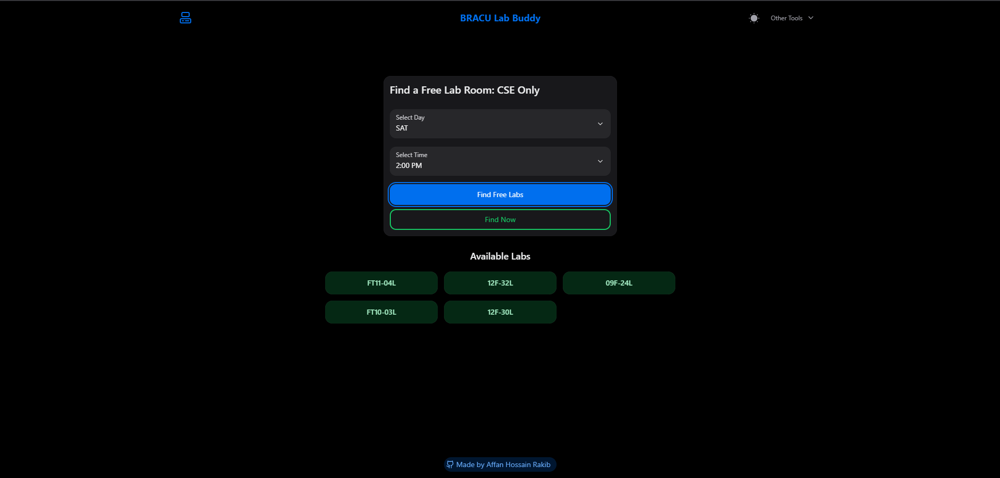

# 🎓 BRACU Lab Buddy

A web application designed to help BRAC University CSE students quickly find available computer science lab rooms based on day and time.



## 📋 Overview

BRACU Lab Buddy is a simple yet powerful tool that helps Computer Science & Engineering students at BRAC University locate free lab rooms. Whether you need a place to work on projects, study, or collaborate with classmates, this app provides real-time availability information based on the official lab schedule.

## ✨ Features

- 🔍 **Search by Day & Time** - Select any day and time slot to find available labs
- ⚡ **Find Now** - Instantly check which labs are free at the current moment
- 📱 **Responsive Design** - Works seamlessly on desktop, tablet, and mobile devices
- 🎨 **Modern UI** - Clean and intuitive interface built with HeroUI components
- 🌓 **Dark/Light Mode** - Toggle between themes for comfortable viewing
- 📊 **Comprehensive Lab Data** - Includes all CSE lab rooms and their schedules

## 🚀 Technologies Used

- **React 18** - Modern UI library for building interactive interfaces
- **TypeScript** - Type-safe development
- **Vite** - Fast build tool and development server
- **React Router** - Client-side routing
- **Tailwind CSS 4** - Utility-first CSS framework
- **HeroUI** - Beautiful React component library
- **Framer Motion** - Smooth animations
- **Lucide React** - Modern icon library

## 📦 Dependencies

### Production Dependencies

```json
{
  "@heroui/alert": "^2.2.27",
  "@heroui/button": "^2.2.24",
  "@heroui/card": "^2.2.23",
  "@heroui/chip": "^2.2.20",
  "@heroui/dropdown": "^2.3.24",
  "@heroui/input": "^2.4.25",
  "@heroui/navbar": "^2.2.22",
  "@heroui/select": "^2.4.25",
  "@heroui/switch": "^2.2.22",
  "@heroui/theme": "^2.4.20",
  "framer-motion": "11.18.2",
  "lucide-react": "^0.541.0",
  "react": "18.3.1",
  "react-dom": "18.3.1",
  "react-router-dom": "6.23.0",
  "tailwindcss": "4.1.11"
}
```

### Development Dependencies

```json
{
  "@vitejs/plugin-react": "4.7.0",
  "eslint": "9.25.1",
  "prettier": "3.5.3",
  "typescript": "5.6.3",
  "vite": "6.0.11"
}
```

## 🛠️ Local Setup

Follow these steps to run the project on your local machine:

### Prerequisites

- Node.js (v18 or higher)
- npm or yarn package manager

### Installation

1. **Clone the repository**

```bash
git clone https://github.com/AffanHossainRakib/BRACU-Lab-Buddy.git
cd BRACU-Lab-Buddy
```

2. **Install dependencies**

```bash
npm install
```

3. **Start the development server**

```bash
npm run dev
```

4. **Open your browser**

Navigate to `http://localhost:5173` (or the port shown in your terminal)

### Available Scripts

- `npm run dev` - Start development server
- `npm run build` - Build for production
- `npm run preview` - Preview production build locally
- `npm run lint` - Run ESLint to check code quality

## 📊 Lab Schedule Data

The application uses `CSE_Lab_Schedule.json` which contains lab schedules for all CSE courses including:

- Course codes (CSE101 to CSE491)
- Lab days (SAT, SUN, MON, TUE, WED, THU)
- Lab times (8:00 AM, 11:00 AM, 2:00 PM)
- Lab room numbers (09B-08L, FT10-01L, 12B-20L, etc.)

## 🌐 Live Demo

Visit the live application: **[BRACU Lab Buddy](https://bracu-lab-buddy.pages.dev/)**

## 📂 Project Structure

```
BRACU-Lab-Buddy/
├── public/
│   ├── CSE_Lab_Schedule.json    # Lab schedule data
│   └── screenshot.png           # App screenshot
├── src/
│   ├── components/              # Reusable React components
│   │   ├── icons.tsx
│   │   ├── navbar.tsx
│   │   ├── theme-switch.tsx
│   │   └── primitives.ts
│   ├── config/                  # Configuration files
│   │   └── site.ts
│   ├── layouts/                 # Layout components
│   │   └── default.tsx
│   ├── pages/                   # Page components
│   │   └── index.tsx
│   ├── styles/                  # Global styles
│   │   └── globals.css
│   ├── types/                   # TypeScript type definitions
│   │   └── index.ts
│   ├── App.tsx                  # Main app component
│   ├── main.tsx                 # Entry point
│   └── provider.tsx             # Context providers
├── eslint.config.mjs            # ESLint configuration
├── package.json                 # Dependencies and scripts
├── tailwind.config.js           # Tailwind CSS configuration
├── tsconfig.json                # TypeScript configuration
├── vite.config.ts               # Vite configuration
└── vercel.json                  # Vercel deployment config
```

## 🤝 Contributing

Contributions are welcome! If you'd like to improve the project:

1. Fork the repository
2. Create a feature branch (`git checkout -b feature/amazing-feature`)
3. Commit your changes (`git commit -m 'Add some amazing feature'`)
4. Push to the branch (`git push origin feature/amazing-feature`)
5. Open a Pull Request

## 📝 License

This project is licensed under the MIT License - see the [LICENSE](LICENSE) file for details.

## 👨‍💻 Author

**Affan Hossain Rakib**

- GitHub: [@AffanHossainRakib](https://github.com/AffanHossainRakib)

## 🙏 Acknowledgments

- BRAC University for the lab schedule data
- HeroUI team for the amazing component library
- All contributors and users of BRACU Lab Buddy

---

Made with ❤️ for BRACU CSE students
